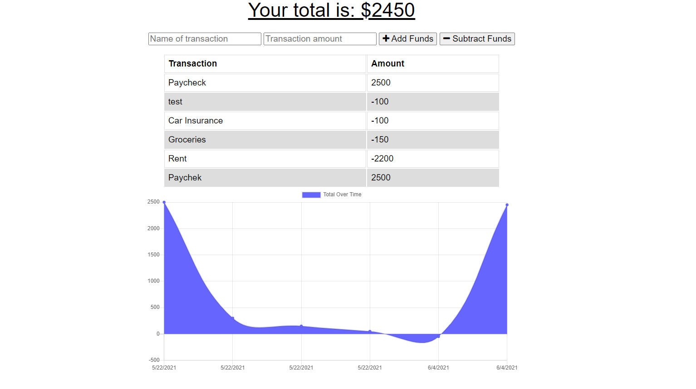

# Budget Tracker

## Link to deployed site:

## Description 
This application allows a user to tracker incoming and outgoing funds wheteher they are online or offline.  

## Table of Contents

* [Installation](#installation)
* [Usage](#usage)
* [Features](#features)
* [Screenshots](#screenshots)

## Installation

To use this site for your own website or your client's website, follow these steps: 
    1. Fork this repo 
    2. Create a local clone of your fork 
    3. Create a MongoDB database called "budgetDB" 
    4. run npm i
    5. run nom start 

## Usage 

To use this app, a user can input an amount and a description of the amount and choose whether to add or subtract this amount from their total funds. The app utilizes chart.js to display a visual representation of the user's spend. 

# Screenshots

